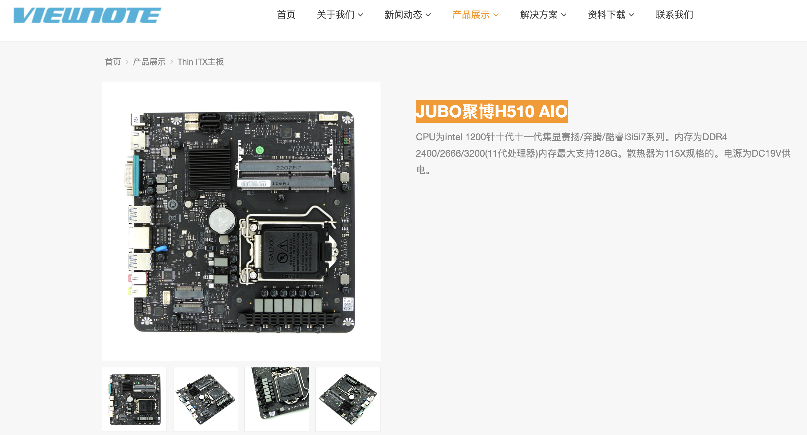
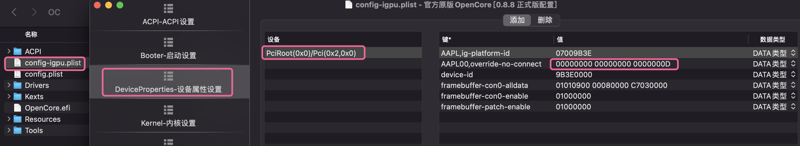
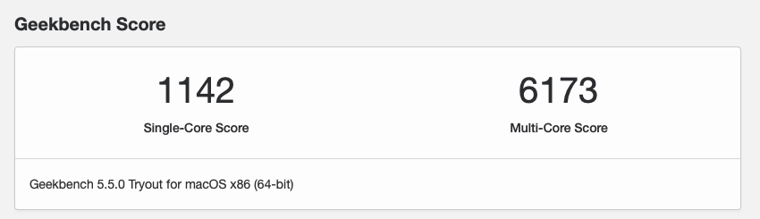

# JUBO-H510-AIO-T3 Hackintosh OpenCore EFI

### [简体中文](README.zh_CN.md)

### OpenCore

[OpenCore 0.9.1](https://github.com/acidanthera/OpenCorePkg)

### OS Version Tested

- macOS Monterey 12.x
- macOS Ventura  13.x 

### Hardware

- Motherboard:JUBO-H510-AIO T3
- CPU: Intel i9-10900 ES (QTB1)
- RAM: ADATA 32GB(16G*2) DDR4 2666MHz
- SSD: WD BLACK SN770 500G MacOS
- iGPU: Intel UHD630
- Audio: 
- Ethernet: Realtek Controller
- Wireless: BCM94360Z
- PSU: DC-ATX

### Bios Setup

| Name | Option |
| ----- | --- |

### Notes

 - Use [OpenCore Configurator](https://mackie100projects.altervista.org/opencore-configurator/) build your SMBIOS
 
 - When u only use 10th CPU UHD630 on JUBO-H510-AIO-T3 with HDMI
 - 1.search montior EDID in Windows
 - 2.U must insert your montior EDID in config.plist DeveciProperties -- PciRoot(0x0)/Pci(0x2,0x0) -- AAPL00,override-no-connect -- 00000000 00000000 00000000 （replace this）
 
[500Series With 10th CPU UHD630 in Macos Video](https://www.bilibili.com/video/BV1UW4y1J7J2/)

 
### ScreenShot 

- Geekbench5 Score i9-10900 ES (QTB1)

